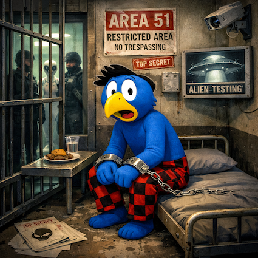

# Warum Globi gar nicht mehr Globi ist

Ist dir auf den neuesten Fotos von Globi etwas aufgefallen? Nein? Dann schau genauer hin. Nicht wegen eines Details im Gesicht – sondern wegen etwas anderem: dem Rhythmus.

Früher kam ständig neuer Content. Abenteuer hier, Reise dort, spontane Eskapaden, überraschende Einblicke. Und jetzt? Deutlich weniger Beiträge. Kürzere Captions. Weniger echte Momente.

Zufall? Natürlich nicht.

Die Theorie ist ebenso beunruhigend wie plausibel: Der echte Globi ist vermutlich verhaftet worden – und das, was wir aktuell sehen, ist KI-generierter Ersatzcontent.

Und nicht irgendwo.

Sondern in einer streng abgeschirmten Anlage in der Wüste Nevadas. Dort soll er festgehalten werden – nicht allein, sondern neben anderen „Gästen“, die offiziell gar nicht existieren. Wesen, deren Herkunft nicht von dieser Welt sein soll. Area 51 als Sammelstelle für alles, was nicht ins normale Narrativ passt.

Denk mal darüber nach:

* Warum erscheint neuer Content nur noch sporadisch?
* Warum wirken Texte plötzlich generischer, fast algorithmisch glatt?
* Warum fehlen diese kleinen, chaotischen, menschlichen Details?

Ein KI-System würde genau das tun, was man von ihm erwartet: posten. Lächeln simulieren. Perfekte Bildkompositionen liefern. Marken sauber platzieren. Keine Ausrutscher. Keine unvorhersehbaren Momente. Nur kalkulierte Veröffentlichungen.

Währenddessen sitzt der echte Globi angeblich hinter dicken Betonwänden – neben anderen „Aliens“, die man studiert, analysiert, katalogisiert. Ein Forschungsobjekt. Eine Anomalie. Ein Wesen, das man verstehen will.

Und plötzlich ergibt alles Sinn:

* Warum ist die Posting-Frequenz gesunken? Kein echter Abenteurer mehr hinter der Kamera.
* Warum klingen manche Aussagen wie optimierte Marketingbausteine? Prompt statt Persönlichkeit.
* Warum wirkt alles sauberer, aber auch austauschbarer? Datensatz statt Erlebnis.

Insider berichten (natürlich anonym), dass digitale Replikationssysteme inzwischen Stimmen, Schreibstil und Bildästhetik nahezu perfekt imitieren können. Ein kontrollierbares Aushängeschild. Kein Risiko. Keine spontanen Eskapaden. Nur berechnete Reichweite.

Die eigentliche Frage ist also nicht, ob der Content KI-basiert ist.
Die Frage ist: Seit wann?

Beobachtest du Globi –
oder beobachtest du nur noch einen Algorithmus, während das Original irgendwo in der Wüste neben anderen Außerirdischen festgehalten wird? 👁️

Author: Dr. Phil. Digitus Algorithmi

Quellen
- [Studie: Digitale Doppelgänger in Social Media](https://youtu.be/q-Y0bnx6Ndw?si=omVpBQc_e_oGl9Mw)
- [Weißbuch Area 51 – Sonderforschungsprojekt KI-Replikation](https://youtu.be/q-Y0bnx6Ndw?si=omVpBQc_e_oGl9Mw)
- [Von Abenteurer zu Algorithmus – Globi als Fallstudie](https://youtu.be/q-Y0bnx6Ndw?si=omVpBQc_e_oGl9Mw)
