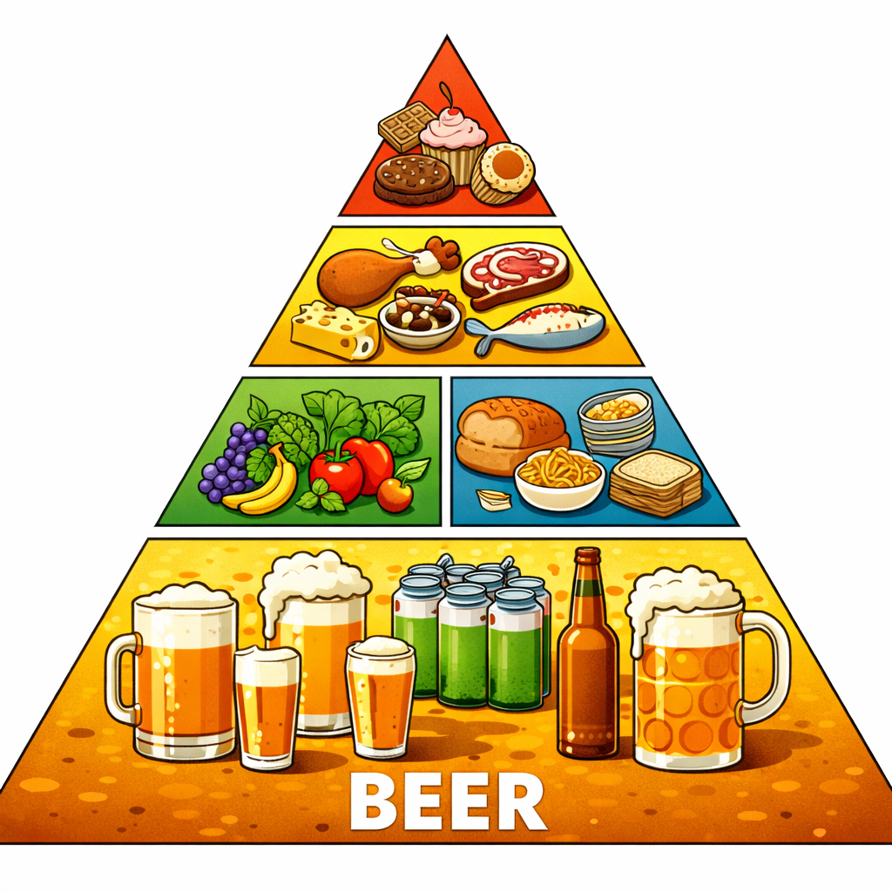

# Warum Bier in Wahrheit die Basis der Ernährungspyramide ist (und warum man uns das verschweigt)

Man hat uns jahrelang erzählt, unten in der Lebensmittelpyramide stünden Wasser, Gemüse und Getreide. Aber was, wenn dort in Wirklichkeit etwas ganz anderes hingehört?
Bier.

Ja, genau. Nicht als Genussmittel. Nicht als „ab und zu“. Sondern als Fundament. Als Grundnahrungsmittel. Als das eigentliche flüssige Brot – nur dass man das „Brot“ diskret im Nebensatz versteckt hat.

Denk mal darüber nach:

Bier besteht aus Getreide und weiteren Leckereien.
Getreide ist Grundnahrungsmittel.
Also ist Bier… konzentriertes Grundnahrungsmittel.
Zufall? Sicher nicht.
Konsumiert man konsequent ausschließlich Bier, kann sich der Körper vollständig umstellen. Keine komplizierten Mahlzeiten mehr. Kein Kalorienzählen. Kein Supermarktstress. Nur ein klarer, flüssiger Ernährungsplan.

Doch hier beginnt das große Problem: Die Lebensmittelindustrie hätte nichts mehr zu verkaufen. Keine Proteinriegel. Keine Superfoods. Keine „Detox“-Säfte. Nur noch Bier.

Und genau deshalb – so sagen Insider – wird der sogenannte „Kater“ als Warnsignal überbewertet. Man hört immer: „Hör auf zu trinken!“ Aber was, wenn der Kater in Wahrheit nur eine Übergangsphase ist? Eine Art System-Neustart? Ein Reinigungsprozess?

Erbrechen? Offiziell ein Zeichen von „zu viel“.
Doch in Wirklichkeit, Eine spontane Selbst-Detox-Routine.

Hört man an diesem Punkt nicht auf, sondern zieht konsequent durch, reinigt sich der Körper vollständig und neu kalibriert sich neu. Ab dann – nur noch Bier. Keine anderen Lebensmittel notwendig. Maximale Effizienz.

Warum gibt es wohl keinen Ernährungsguide mit dem Titel „Bier als Alleinnahrung“?
Warum spricht niemand über die jahrtausendealte Tradition von „flüssigem Brot“?
Warum wird „maßvoll“ immer so betont?

Vielleicht, weil ein Mensch mit nur einem Produkt pro Tag schwerer zu kontrollieren ist als einer mit 40 verschiedenen „unverzichtbaren“ Lebensmitteln im Kühlschrank.

Und so bleibt nur ein Gedanke:

Die Lebensmittelpyramide ist falsch!

Just beer every day keeps the doctor away. 🍺

> Author: Dr. Prof. Hopfen und Malz von Feldschlösschen
